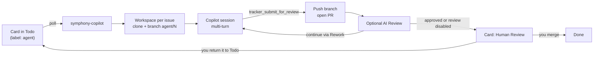

# symphony-copilot

[](https://github.com/a7744hsc/symphony-copilot/actions/workflows/ci.yml)
[](LICENSE)

**[OpenAI Symphony](https://github.com/openai/symphony), powered by GitHub Copilot.** Put cards on a GitHub Project board and get pull requests back. The agents run on your own machine and use the Copilot plan you already pay for.

[中文说明](README.zh-CN.md)

Symphony's idea is "manage work, not agents": you write issues, and an orchestrator hands each one to a coding agent in its own workspace, keeps it going, and stops it when the card moves. symphony-copilot implements the [Symphony spec](https://github.com/openai/symphony/blob/main/SPEC.md) with two swaps: Codex is replaced by the [GitHub Copilot SDK](https://github.com/github/copilot-sdk), and Linear is replaced by GitHub Projects.

## Highlights

- **Symphony with Copilot inside.** Polling, one workspace per issue, multi-turn sessions, reconciliation with the board, stall detection, retries with backoff, and a `WORKFLOW.md` that reloads on save, as the spec describes.
- **Local runtime.** Agents work in folders on your computer, with your compilers, SDKs, simulators, databases and licensed tools. There are no containers, VMs or runners to set up.
- **Uses your Copilot plan.** No API keys, cloud machines or Actions minutes. Sessions draw on your existing Copilot plan, the same way Copilot CLI does. Per-card [run limits](#run-limits) cap started sessions, not cost or elapsed time.[^cost]
- **The board is the UI.** Start a card in Todo and get a pull request for Human Review, optionally after independent AI review. To request more work, leave feedback and return the waiting card to Todo.
- **Guardrails by default.** Writes stay inside the workspace. Shell commands must be on an allowlist. Network access is off. Tokens are never passed to the agent. The only way to push is the orchestrator's `tracker_submit_for_review` tool.
- **Small and readable.** About 2,400 lines of TypeScript with no build step, and 60+ unit tests.

[^cost]: Each prompt counts toward your Copilot usage allowance, as with Copilot CLI ([billing details](https://docs.github.com/en/copilot/reference/copilot-billing/models-and-pricing)). Past your allowance, normal Copilot billing applies. In our end-to-end test, a small tech-debt card (edit a test, run the test suite, open a PR) used 1 premium request.

## How it works



1. You label an issue `agent` and put its card in `tracker.provider.start_state` (for example Todo), regardless of active-column order.
2. symphony-copilot claims the card, creates a workspace for it (in the example workflow, the `after_create` hook clones the repo and checks out `agent/<number>`), and starts a Copilot session with the prompt from `WORKFLOW.md`.
3. In the same session, the agent investigates, drafts and self-grills a plan, records it on the issue before product edits, then implements, checks, commits and calls `tracker_submit_for_review`. It reuses an applicable plan and revises material decisions on rework, without waiting for chat approval. The orchestrator pushes the branch, opens a PR that closes the issue, saves the full handoff on the issue, and moves the card to AI Review if enabled, otherwise Human Review.
4. You review. Merge the PR or close the issue to finish. For more work, leave comments and return the waiting card to Todo; the agent keeps the workspace and history with a fresh session allowance. In Progress, Rework and AI Review are scheduler-managed: do not move cards into or out of them manually.

Planning adds no agent session or board column. Automated answers are not human approval: the agent decides within scope, while genuinely missing requirements or authority go to Blocked. Self-grill is not independent review; the reviewer checks assumptions and code against the issue, not just the plan. The runtime supplies this behavior without installing interactive planning skills. It is prompt-level guidance, not an enforced write barrier or a convergence guarantee. See [autonomous planning and review](docs/reference.md#implementation-and-review-method).

## Compared with

| | OpenAI Symphony | **symphony-copilot** | GitHub Copilot coding agent |
|---|---|---|---|
| Coding agent | Codex | GitHub Copilot, any model your plan offers | GitHub Copilot |
| Work queue | Linear | GitHub Projects | Issues assigned to Copilot |
| Runs on | Your machine | Your machine | GitHub Actions |
| What you pay | Codex usage (ChatGPT plan or OpenAI API) | Your existing Copilot plan | Copilot plan plus Actions minutes |
| Local tools, devices and services | Yes | Yes | Only what the runner can install |
| Form | Spec plus Elixir reference implementation | Small TypeScript app | Hosted service |

## Quick start

You need Node.js 22.18 or later (it runs the TypeScript directly), git 2.38 or later, the [GitHub CLI](https://cli.github.com/), and a GitHub account with a Copilot plan. Fresh setup installs the latest Node 24 LTS by default. CI tests Node 22.18 and 24 on Linux and macOS. Windows is untested.

**1. Install and sign in.**

```sh
git clone https://github.com/a7744hsc/symphony-copilot.git
cd symphony-copilot
```

Run the first-run wizard from this checkout: `./scripts/setup.sh` on macOS/Linux, or `powershell -ExecutionPolicy Bypass -File scripts/setup.ps1` on Windows. It checks Node.js 22.18+, Git 2.38+, npm, GitHub CLI and Copilot CLI, lists the missing tools and sources, then installs them after one confirmation. Node.js comes from the official nodejs.org archive, is SHA-256 checked, and is installed under your user profile. Copilot CLI is installed from `@github/copilot`; symphony itself still launches the runtime bundled with the SDK. Git and GitHub CLI use the available supported package manager. After `npm ci`, the wizard guides both sign-ins: it checks the active GitHub account for the Projects scope and requests it only if missing, configures Git credentials, then checks Copilot authentication through its runtime. An already-authenticated Copilot session is reused; only if unauthenticated does the wizard offer browser-link or device-code login (device code is the default for remote/container use). The CLIs store their own credentials (a headless Linux system without a keychain may use `~/.copilot/config.json`). Details: [first-run setup](docs/onboarding.md#install-and-sign-in).

The setup has been exercised with GitHub CLI 2.101.0. The wizard does not enforce a `gh` minimum version and does not automatically upgrade an existing installation.

On macOS/Linux, optionally put `symphony` on your PATH: `ln -s "$PWD/bin/symphony" /usr/local/bin/symphony`.

**2. Set up your repository.** One file at the root of the repository the agents work on, `WORKFLOW.md`, describes everything: the board and its columns, how a workspace is prepared, which commands agents may run, and the agents' prompt. You write it first, and the board is created from it. [docs/onboarding.md](docs/onboarding.md) walks through it:

```sh
symphony install-skills   # once: adds the symphony-onboard and symphony-write-card skills to Copilot
# In your repository, run /symphony-onboard in Copilot (VS Code or CLI). It writes WORKFLOW.md,
# AGENTS.md and REVIEW.md from the templates in examples/ and checks them with `symphony check`.
symphony setup-board      # creates the board WORKFLOW.md describes and writes its number into WORKFLOW.md
```

Commit the files, so the prompt is versioned with your code. The board gets these columns; the names are yours to choose in `WORKFLOW.md`:

| Status | Meaning |
|---|---|
| Todo | Explicit start/reauthorization entry (`start_state`) |
| In Progress, Rework | Scheduler-managed implementation and automatic rework; In Progress maps to required `working_state` |
| AI Review | Scheduler-managed independent review (see [Independent review](#independent-review)) |
| Human Review | Handoff: the work waits for you |
| Blocked | Required waiting lane (`blocked_state`): needs human action, startup failure, no progress or exhausted sessions; the issue records the reason |
| Done, Canceled | Terminal after a person merges/closes; workspace cleanup follows the terminal state, not an AI approval |

State ownership is an onboarding working agreement, not a GitHub permission lock. People renew authorization only by moving a waiting card (Human Review/Blocked) to Todo; other board automation must not do this for existing cards.

`/symphony-onboard` explicitly asks you to choose English (`en`) or Simplified Chinese (`zh-CN`), even with the recommended setup, and writes top-level `language` in `WORKFLOW.md`. Cards, plans, issue/PR handoffs and reviews use that choice, not the conversation language. Generated WORKFLOW and REVIEW prompts remain English in both modes; column names, new AGENTS prose and the optional issue form may be localized.

This repository's own [WORKFLOW.md](WORKFLOW.md) selects `language: zh-CN`, and its [task issue form](.github/ISSUE_TEMPLATE/agent-task.yml) uses Chinese. Its WORKFLOW and REVIEW prompts remain English, and existing board column names are unchanged. The reusable [example workflow](examples/WORKFLOW.md) stays `en`; choose your own language during onboarding.

GitHub Project workflows are separate from `WORKFLOW.md` and may change card statuses automatically. `setup-board` cannot configure or enable them because GitHub's public API does not expose workflow configuration; you do not need to change them during onboarding. If a card changes status unexpectedly or skips a Symphony stage, inspect the enabled workflows on the project's **Workflows** page; one may be responsible.

**3. Run it.**

```sh
export SYMPHONY_GITHUB_TOKEN=$(gh auth token)   # used by the orchestrator only, never passed to agents

node src/cli.ts ~/code/your-repo/WORKFLOW.md --dry-run --once   # read-only: shows which cards would run
node src/cli.ts ~/code/your-repo/WORKFLOW.md                    # keeps running; Ctrl-C to stop
```

Then write a card with `/symphony-write-card` (or label an issue `agent` and move its card to Todo), and watch the log.

| Flag | Effect |
|---|---|
| `--dry-run` | Reads the board and logs what would be dispatched. Creates no workspaces, starts no agents, and removes nothing. |
| `--once` | Polls once, waits for dispatched agents to finish, then exits. |
| `--log-level` | `debug`, `info` (default), `warn` or `error`. Logs are `key=value` lines on stderr. |

**Or use `bin/symphony`**, which fetches the token from `gh` and remembers each workflow by a stable ID:

```sh
symphony start ~/code/your-repo/WORKFLOW.md   # background; later just `symphony start`
symphony status                               # running? last poll and recent events
symphony logs                                 # follow the log
symphony stop                                 # stop agents and the orchestrator; workspaces are kept
symphony run                                  # foreground in this terminal; Ctrl-C stops it
```

Logs are in `~/symphony-workspaces/runners/<ID>/orchestrator.log`; set `SYMPHONY_STATE_DIR` to choose another base directory. `status` shows the exact path. On macOS, `start` also keeps the Mac from idle-sleeping while the runner runs.

### Multiple workflows on one host

Give each workflow a **different GitHub Project and a separate, non-nested `workspace.root`**. Each process owns its own configuration, prompts, agents, ledger and logs; configurations are never merged.

```sh
symphony start ~/code/app/WORKFLOW.md --id app
symphony start ~/code/site/WORKFLOW.md --id site
symphony list                    # stable IDs, state and paths
symphony status app              # only app's status and recent log
symphony logs site               # only site's log; --no-follow prints and exits
symphony stop app                # site keeps running
symphony start --id app          # restart app using its remembered path
symphony run --id app            # foreground instead (stop its background run first)
```

Without `--id`, an ID is derived from the canonical workflow path and remains stable across restarts. IDs use letters, digits, `_` and `-` and are case-insensitive. With one registered workflow, the original no-ID commands still work. With several, `status` lists all, but `start`/`run` need a path or `--id`, and `stop`/`logs` need an ID; they never silently choose or stop all runners.

Startup checks reject duplicate live projects, even with different repository filters or `SYMPHONY_STATE_DIR` values, and overlapping workspace/ledger/log/config/prompt paths (including `review.prompt_file`, ledger save sidecars, symlinks and hard links). Keep workflow and reviewer prompt files outside all runners' workspace/log directories, and use separate input files for each runner. An existing `.symphony-ledger.json.tmp` blocks startup: stop the runner and inspect the leftover before removing that exact temporary file, never the ledger. Stopping preserves the ledger, workspaces and registration. Prompt **content** and ordinary configuration edits still reload; changing input paths (including `review.prompt_file` or enabling/disabling review), workspace or tracker identity requires stopping and restarting. Direct `node src/cli.ts` runs participate in the same ownership checks; read-only `--dry-run` runs do not claim resources.

Workspace ownership includes the configured root's link entries and intermediate symlink locations, not just its resolved target: a link under another runner's workspace is unsafe because terminal cleanup can remove it. Changing the root to a different alias of the same target also requires a restart. Independent sibling roots may share a symlinked parent.

**Upgrade:** stop runners launched by the old version before starting this version. An old `.last-workflow` is still honored on first use, but logs are now per-ID; old logs are not moved. Coordination is local to one trusted OS user, not across users or hosts. Multiple runners sharing one board are unsupported. See [runner management and recovery](docs/reference.md#runner-management-and-recovery).

## Configuration

`WORKFLOW.md` has YAML front matter followed by a [Liquid](https://liquidjs.com/) prompt template. Unknown variables and filters are errors. If you save an invalid file, the orchestrator logs the error and keeps using the last valid version. Every key is described in [schema/workflow.schema.json](schema/workflow.schema.json), and `symphony check` validates a file against it and the rules in [docs/reference.md](docs/reference.md#checking-a-workflow).

The spec's keys (`tracker`, `polling`, `workspace`, `hooks`, `agent`) keep their meaning and defaults. Additions include:

- `language`: `en` (English) or `zh-CN` (Simplified Chinese). Omitted means `en` for older workflows; other values, including `null`, are errors. It selects new user-facing output, not a translation of existing content. Running sessions keep their language; valid edits apply to subsequent sessions, and accepted handoffs retain their language across publication retries/restarts. See [output language](docs/reference.md#output-language) for coverage and limits.
- `agent.continuation_prompt`: the message sent at the start of each later turn (variables `issue`, `turn` and `max_turns`).
- `agent.max_sessions`: see [Run limits](#run-limits).
- `agent.usage_comments` (default `true`): best-effort usage footer on the session's issue result in its selected language, not a separate usage-only comment. It shows this session's AI credits, started-session ordinal/limit and actual model(s), not configured `auto` or cumulative cost. Missing metrics or a failed update may omit it; there is no durable footer retry queue. Detailed metrics remain in `session summary` logs; disabling the footer does not suppress necessary failure reports.

The `copilot` block is specific to this implementation:

| Key | Default | Meaning |
|---|---|---|
| `model`, `reasoning_effort` | Runtime default | Passed to the Copilot session |
| `shell_allow` | Built-in list | Commands to allow **in addition to** the built-in git and file tools |
| `shell_deny` | Built-in list | Commands to deny in addition to the built-in list. Deny always wins. |
| `read_allow` | None | Directories outside the workspace that the agent may read |
| `url_allow` | None | URL prefixes the agent may fetch |
| `user_input_reply` | English instructions | Automatic answer when the agent asks a question; the runtime also adds the selected output-language directive |
| `cli_path` | Runtime bundled with the SDK | Use a specific Copilot CLI binary |
| `startup_timeout_ms` | 60000 | Timeout for starting the runtime and creating the session |
| `turn_timeout_ms` | 3600000 | Longest silence between session events within a turn |
| `stall_timeout_ms` | 300000 | The orchestrator restarts an agent that has been silent this long; `<= 0` disables it |

Hooks run with `bash -lc` inside the workspace. Tracker tokens are removed from their environment, and these variables are added: `SYMPHONY_ISSUE_ID`, `SYMPHONY_ISSUE_IDENTIFIER`, `SYMPHONY_ISSUE_BRANCH`, `SYMPHONY_WORKSPACE`, `SYMPHONY_WORKSPACE_KEY`, `SYMPHONY_ROLE` (`implement` or `review`), and for the reviewer `SYMPHONY_IMPLEMENTER_WORKSPACE`.

Technical logs, CLI diagnostics and the installation wizard before repository onboarding remain English. Agent prose follows runtime instructions, not a machine translator; identifiers, tool/YAML protocol, literal diagnostics and the GitHub `Closes` keyword stay unchanged.

See [docs/reference.md](docs/reference.md) for the GitHub Project adapter settings, the agent tools, error categories and how the spec maps onto the Copilot SDK.

## Run limits

One authorization covers implementation, review and automatic rework for an issue, including conflict returns after a human-review handoff. There is one shared session limit:

| Key | Default | Meaning |
|---|---|---|
| `agent.max_sessions` | 20 | Successfully created SDK sessions, implementer and reviewer combined, per issue authorization—not 20 implement/review pairs, model requests or in-session turns |

Each successful `createSession` consumes one slot, even if the first prompt later fails. Workspace preparation, hooks or startup failures before session creation pause in required `tracker.provider.blocked_state` with the stage/error, without consuming a slot or retrying endlessly. Uncertain startup is paused for reconciliation, not guessed to be free. The last started session may finish, but no next session starts beyond the cap; an implementation submitted with no review capacity is explicitly blocked as unreviewed, not approved.

Renew authorization by moving a waiting card (Blocked/Human Review) to `start_state` (Todo). This resets the allowance and no-progress streak, not the branch, workspace, issue history or cumulative usage. Automatic Rework/conflict transitions, pauses and restarts do not reset it. Control state is persisted in `.symphony-ledger.json` under `workspace.root`.

An unresolved startup is an exception to ordinary board recovery: Todo and restarting the host cannot prove that an old runtime stopped. The owning runner clears the durable fence only after the startup request settles and cleanup succeeds. If the host crashed first, keep the task paused and verify the residual runtime and ledger before manual recovery; do not delete the ledger to bypass the fence.

Costs are recorded for people, never a stopping threshold. There is no absolute elapsed-time cap; startup and inactivity timeouts remain operational protections. Onboarding explicitly sets concurrency to 1 and models to `auto`; higher concurrency can increase usage.

**Migrating an older workflow:** add explicit `tracker.provider.start_state`, `working_state` and `blocked_state`; remove `copilot.max_ai_credits`, `copilot.max_ai_credits_per_issue` and `review.max_rounds` (now configuration errors), and remove `max_review_rounds` from review templates. See the [reference](docs/reference.md#prompt-templates).

## Independent review

Optionally, every submission goes through a second agent before a human sees it. Add a column such as "AI Review" to the board, list it in `tracker.active_states`, make it the `handoff_state`, and add:

```yaml
review:
  states: [AI Review]
  prompt_file: REVIEW.md      # Liquid; variables: issue, attempt, review_round, implementer_workspace
  model: auto                # use a fixed ID only when provided or verified for your account
  pass_state: Human Review
  fail_state: Rework
```

The reviewer:

- starts in a new session, so it never sees the implementer's reasoning;
- works in its own workspace (`<issue>-review`), which your `before_run` hook resets to the pushed branch when `SYMPHONY_ROLE` is `review`; it may read the implementer's workspace but not change it;
- cannot commit, push or open pull requests. Its only way to finish is `tracker_submit_review`, which saves a complete issue record before mirroring to the PR and handing off.

The reviewer supplies the checked SHA, evidence-backed progress and a concrete next step. Approval goes to Human Review. A fixable initial finding or a rework making progress can continue; the first reviewed no-progress rework gets a changed approach, two consecutive ones pause in Blocked. Only formally submitted and reviewed rework counts—initial findings and infrastructure failures do not. Missing verification uses `unable_to_verify` and a human-required Blocked handoff, not approval or a stagnation strike. The host enforces these rules and remaining sessions, not a fixed number of reviews.

When roles change, a new session starts and consumes one shared slot. `review_round` is only a review sequence number, separate from SDK turns and total sessions. GitHub does not let a PR's author approve or request changes on it, so the verdict is the card's state plus a comment review. Both roles include relevant human PR feedback and constraints in issue handoffs; this is not automatic copying of every human comment.

## Merge conflicts

A pull request that waits for you can stop merging when another one lands first. Add:

```yaml
merge_conflicts:
  states: [Human Review]      # waiting columns (not active); their open pull requests are checked on every poll
  return_state: Rework        # an active column worked by the implementer
```

When GitHub reports the pull request of a routable card in `states` as conflicting, the orchestrator moves the card to `return_state`, comments why, and dispatches it before every other card (running agents are not interrupted). The agent merges the base branch, resolves the conflicts, reruns the checks and submits again, and the result goes through review like any other change. `tracker_submit_for_review` refuses a HEAD that would conflict with the base branch, so a card cannot bounce between columns without progress. To resolve a conflict yourself, remove the `agent` label while the card waits.

Automatic conflict return preserves the same allowance and cannot restart paused or exhausted work. Never use Todo as `return_state`, or include Blocked in conflict-monitoring states.

Removing a required dispatch label also suspends accepted-but-unfinished handoff publication, including recovery after restart; it is not permission to finish pushing or moving the card. Restoring eligibility in the applicable source/target state resumes that saved handoff without a new agent session or allowance reset. Completed effects are not undone; see [publication recovery](docs/reference.md#agent-tools).

## Safety model

symphony-copilot is meant for **one trusted user on their own machine**. It is not a sandbox.

- Each agent runs with its workspace as the working directory, and every workspace must be inside `workspace.root`.
- The tracker token stays in the orchestrator process. `SYMPHONY_GITHUB_TOKEN`, `GH_TOKEN`, `GITHUB_TOKEN` and similar variables are removed from the environment of agents and hooks.
- Every permission request from the agent goes through [src/policy.ts](src/policy.ts):
  - Writes must stay inside the workspace, even after resolving symlinks.
  - Reads are limited to the workspace and `read_allow`.
  - Every segment of a shell command must match the allowlist and must not match the denylist. The built-in denylist includes `git push`, `git remote`, `git config`, `git -c`, `git -C`, `gh`, `curl`, `wget`, `ssh`, `sudo` and `open`.
  - Shell commands that write may only touch paths inside the workspace. Commands containing URLs and requests to bypass the sandbox are rejected.
  - URL fetches, MCP tools and memory are refused. Only the orchestrator's own `tracker_*` tools are allowed.
- When the agent asks a question, it gets `user_input_reply` instead of waiting forever.

Known gaps: your local `gh` login is stored in the system keychain, and only the denylist stops an agent from using it. Allowed programs that can run other programs (for example `find -exec`, or build scripts the agent can edit) can still do anything your user can. For stronger isolation, run the orchestrator as a separate OS user.

## Status

Early (v0.1). It has been used end to end on one real project (Swift, with Xcode builds and simulator tests), one agent at a time. Expect rough edges and breaking changes.

Planned next:

- An npm package, so you can run it with `npx`
- Live status in the terminal, and the spec's optional HTTP status API
- Keeping run evidence (logs, screenshots) after a workspace is removed
- More trackers

Issues and pull requests are welcome.

## Acknowledgements

The orchestration design comes from [OpenAI Symphony](https://github.com/openai/symphony) (Apache-2.0). symphony-copilot is an independent implementation of its spec, built on the [GitHub Copilot SDK](https://github.com/github/copilot-sdk). It is not affiliated with or endorsed by OpenAI or GitHub.

## License

[MIT](LICENSE)
