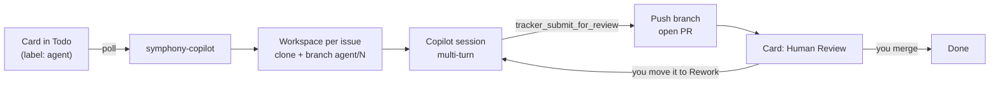

# symphony-copilot

[](https://github.com/a7744hsc/symphony-copilot/actions/workflows/ci.yml)
[](LICENSE)

**[OpenAI Symphony](https://github.com/openai/symphony), powered by GitHub Copilot.** Put cards on a GitHub Project board and get pull requests back. The agents run on your own machine and use the Copilot plan you already pay for.

[中文说明](README.zh-CN.md)

Symphony's idea is "manage work, not agents": you write issues, and an orchestrator hands each one to a coding agent in its own workspace, keeps it going, and stops it when the card moves. symphony-copilot implements the [Symphony spec](https://github.com/openai/symphony/blob/main/SPEC.md) with two swaps: Codex is replaced by the [GitHub Copilot SDK](https://github.com/github/copilot-sdk), and Linear is replaced by GitHub Projects.

## Highlights

- **Symphony with Copilot inside.** Polling, one workspace per issue, multi-turn sessions, reconciliation with the board, stall detection, retries with backoff, and a `WORKFLOW.md` that reloads on save, as the spec describes.
- **Local runtime.** Agents work in folders on your computer, with your compilers, SDKs, simulators, databases and licensed tools. There are no containers, VMs or runners to set up.
- **$0 extra.** No API keys, cloud machines or Actions minutes. Sessions draw on your existing Copilot plan, the same way Copilot CLI does, and per-card [run limits](#run-limits) cap what any one card can spend.[^cost]
- **The board is the UI.** Move a card to Todo and a pull request appears, with the card moved to Human Review. Move the card to Rework and the agent reads the review and continues.
- **Guardrails by default.** Writes stay inside the workspace. Shell commands must be on an allowlist. Network access is off. Tokens are never passed to the agent. The only way to push is the orchestrator's `tracker_submit_for_review` tool.
- **Small and readable.** About 2,400 lines of TypeScript with no build step, and 60+ unit tests.

[^cost]: Each prompt counts toward your Copilot usage allowance, as with Copilot CLI ([billing details](https://docs.github.com/en/copilot/reference/copilot-billing/models-and-pricing)). Past your allowance, normal Copilot billing applies. In our end-to-end test, a small tech-debt card (edit a test, run the test suite, open a PR) used 1 premium request.

## How it works



1. You label an issue `agent` and put its card in an active column (for example Todo).
2. symphony-copilot claims the card, creates a workspace for it (in the example workflow, the `after_create` hook clones the repo and checks out `agent/<number>`), and starts a Copilot session with the prompt from `WORKFLOW.md`.
3. The agent works, runs your checks, commits, and calls `tracker_submit_for_review`. The orchestrator pushes the branch, opens a PR that closes the issue, and moves the card to Human Review.
4. You review. Merge, and the card goes to Done. Or move the card to Rework, and the agent picks it up again in the same workspace, with your review comments.

## Compared with

| | OpenAI Symphony | **symphony-copilot** | GitHub Copilot coding agent |
|---|---|---|---|
| Coding agent | Codex | GitHub Copilot, any model your plan offers | GitHub Copilot |
| Work queue | Linear | GitHub Projects | Issues assigned to Copilot |
| Runs on | Your machine | Your machine | GitHub Actions |
| What you pay | Codex usage (ChatGPT plan or OpenAI API) | Your existing Copilot plan | Copilot plan plus Actions minutes |
| Local tools, devices and services | Yes | Yes | Only what the runner can install |
| Form | Spec plus Elixir reference implementation | Small TypeScript app | Hosted service |

## Quick start

You need Node.js 24 or later (it runs the TypeScript directly), git, the [GitHub CLI](https://cli.github.com/), and a GitHub account with a Copilot plan. It is developed on macOS, and CI also runs the tests on Linux. Windows is untested.

**1. Prepare the board.** Create a GitHub Project (or use an existing one) with these options in its Status field:

| Status | Meaning |
|---|---|
| Todo, In Progress, Rework | Active: the orchestrator runs an agent on these cards |
| Human Review | Handoff: the agent submitted a PR and waits for you |
| Blocked | The agent needs help; it comments on the issue first |
| Done, Canceled | Terminal: the workspace is deleted, right away if an agent is still running, otherwise the next time the orchestrator starts |

Optionally, add a single-select Priority field with options like `P1`, `P2`, `P3` (lower numbers run first). In the project's workflows, set "Pull request linked to issue" to Human Review or turn it off. Otherwise the card jumps back to an active column when the PR opens, and the agent starts again.

**2. Install and sign in.**

```sh
git clone https://github.com/a7744hsc/symphony-copilot.git
cd symphony-copilot
npm install

gh auth login              # the account with your Copilot plan
gh auth refresh -s project # the orchestrator reads and moves cards
gh auth setup-git          # lets the orchestrator push agent branches
```

**3. Add a `WORKFLOW.md` to your repository.** Copy [examples/WORKFLOW.md](examples/WORKFLOW.md) to the root of the repository the agents will work on. Fill in `owner`, `project_number` and `repo`, adjust the status names, and list your build and test commands in `copilot.shell_allow`. The Markdown body is the agent's prompt. Commit the file so the prompt is versioned with your code.

**4. Run it.**

```sh
export SYMPHONY_GITHUB_TOKEN=$(gh auth token)   # used by the orchestrator only, never passed to agents

node src/cli.ts ~/code/your-repo/WORKFLOW.md --dry-run --once   # read-only: shows which cards would run
node src/cli.ts ~/code/your-repo/WORKFLOW.md                    # keeps running; Ctrl-C to stop
```

Then label an issue `agent`, move its card to Todo, and watch the log.

| Flag | Effect |
|---|---|
| `--dry-run` | Reads the board and logs what would be dispatched. Creates no workspaces, starts no agents, and removes nothing. |
| `--once` | Polls once, waits for dispatched agents to finish, then exits. |
| `--log-level` | `debug`, `info` (default), `warn` or `error`. Logs are `key=value` lines on stderr. |

**Or use `bin/symphony`**, which fetches the token from `gh`, remembers the workflow path after the first use, and refuses to start a second orchestrator:

```sh
ln -s "$PWD/bin/symphony" /usr/local/bin/symphony   # optional: put it on your PATH

symphony start ~/code/your-repo/WORKFLOW.md   # background; later just `symphony start`
symphony status                               # running? last poll and recent events
symphony logs                                 # follow the log
symphony stop                                 # stop agents and the orchestrator; workspaces are kept
symphony run                                  # foreground in this terminal; Ctrl-C stops it
```

The background log is `~/symphony-workspaces/logs/orchestrator.log`; set `SYMPHONY_STATE_DIR` to keep the log and PID file elsewhere. On macOS, `start` also keeps the Mac from idle-sleeping while the orchestrator runs.

## Configuration

`WORKFLOW.md` has YAML front matter followed by a [Liquid](https://liquidjs.com/) prompt template. Unknown variables and filters are errors. If you save an invalid file, the orchestrator logs the error and keeps using the last valid version.

The spec's keys (`tracker`, `polling`, `workspace`, `hooks`, `agent`) keep their meaning and defaults. There are three additions:

- `agent.continuation_prompt`: the message sent at the start of each later turn (variables `issue`, `turn` and `max_turns`).
- `agent.max_sessions`: see [Run limits](#run-limits).
- `agent.usage_comments` (default `true`): after every session, the orchestrator comments on the issue with the outcome, model and number of model calls, turns, time, lines changed, AI credits (this session and this run) and tokens. The same summary is always logged as `session summary`.

The `copilot` block is specific to this implementation:

| Key | Default | Meaning |
|---|---|---|
| `model`, `reasoning_effort` | Runtime default | Passed to the Copilot session |
| `max_ai_credits_per_issue` | No limit | AI credit budget per card per run, enforced by the orchestrator (see [Run limits](#run-limits)) |
| `max_ai_credits` | No limit | Per-session cap enforced by the Copilot runtime. The runtime tells the model how much it has used, which made agents cut corners in testing; prefer `max_ai_credits_per_issue`. |
| `shell_allow` | Built-in list | Commands to allow **in addition to** the built-in git and file tools |
| `shell_deny` | Built-in list | Commands to deny in addition to the built-in list. Deny always wins. |
| `read_allow` | None | Directories outside the workspace that the agent may read |
| `url_allow` | None | URL prefixes the agent may fetch |
| `user_input_reply` | English | Automatic answer when the agent asks a question |
| `cli_path` | Runtime bundled with the SDK | Use a specific Copilot CLI binary |
| `startup_timeout_ms` | 60000 | Timeout for starting the runtime and creating the session |
| `turn_timeout_ms` | 3600000 | Longest silence between session events within a turn |
| `stall_timeout_ms` | 300000 | The orchestrator restarts an agent that has been silent this long; `<= 0` disables it |

Hooks run with `bash -lc` inside the workspace. Tracker tokens are removed from their environment, and these variables are added: `SYMPHONY_ISSUE_ID`, `SYMPHONY_ISSUE_IDENTIFIER`, `SYMPHONY_ISSUE_BRANCH`, `SYMPHONY_WORKSPACE`, `SYMPHONY_WORKSPACE_KEY`, `SYMPHONY_ROLE` (`implement` or `review`), and for the reviewer `SYMPHONY_IMPLEMENTER_WORKSPACE`.

See [docs/reference.md](docs/reference.md) for the GitHub Project adapter settings, the agent tools, error categories and how the spec maps onto the Copilot SDK.

## Run limits

A *run* is one stretch of work on a card. It starts when the card is dispatched and ends when the orchestrator sees the card outside the active columns: handed off, blocked, done, or moved by you. The spec keeps starting sessions for as long as a card stays active, so a card that never hands off could spend credits forever. The orchestrator enforces two limits per run:

| Key | Default | Meaning |
|---|---|---|
| `agent.max_sessions` | 5 | Copilot sessions per run. A session ends after `max_turns` turns or when the agent stops. |
| `copilot.max_ai_credits_per_issue` | No limit | AI credits per run, counted live from every model call. The session is stopped as soon as the budget is reached. |

When a run reaches a limit, the orchestrator stops the agent, comments on the issue with what the run used, and moves the card to `tracker.provider.blocked_state` if you set one. The workspace is kept. Moving the card back to an active column starts a new run with fresh limits, and so does rework after a handoff.

The model is never told about these limits. Usage is saved in `.symphony-ledger.json` under `workspace.root`, so restarting the orchestrator does not reset it. For unattended use, set both limits and a `blocked_state`.

## Independent review

Optionally, every submission goes through a second agent before a human sees it. Add a column such as "AI Review" to the board, list it in `tracker.active_states`, make it the `handoff_state`, and add:

```yaml
review:
  states: [AI Review]
  prompt_file: REVIEW.md      # Liquid; variables: issue, attempt, review_round, max_review_rounds, implementer_workspace
  model: gpt-6-sol            # ideally a different model family from the implementer
  pass_state: Human Review
  fail_state: Rework
  max_rounds: 3               # after the last round, a failing card goes to pass_state for a human to decide
```

The reviewer:

- starts in a new session, so it never sees the implementer's reasoning;
- works in its own workspace (`<issue>-review`), which your `before_run` hook resets to the pushed branch when `SYMPHONY_ROLE` is `review`; it may read the implementer's workspace but not change it;
- cannot push or open pull requests. Its only way to finish is `tracker_submit_review`, which posts the verdict on the PR and the issue and moves the card.

When a card moves between implementation and review, the running session ends and the other role starts in a new one. The whole implement-and-review loop counts as one run, so the [run limits](#run-limits) cap it too. GitHub does not let a PR's author approve or request changes on it, so the verdict is the card's state plus a comment review.

## Merge conflicts

A pull request that waits for you can stop merging when another one lands first. Add:

```yaml
merge_conflicts:
  states: [Human Review]      # waiting columns (not active); their open pull requests are checked on every poll
  return_state: Rework        # an active column worked by the implementer
```

When GitHub reports the pull request of a routable card in `states` as conflicting, the orchestrator moves the card to `return_state`, comments why, and dispatches it before every other card (running agents are not interrupted). The agent merges the base branch, resolves the conflicts, reruns the checks and submits again, and the result goes through review like any other change. `tracker_submit_for_review` refuses a HEAD that would conflict with the base branch, so a card cannot bounce between columns without progress. To resolve a conflict yourself, remove the `agent` label while the card waits.

## Safety model

symphony-copilot is meant for **one trusted user on their own machine**. It is not a sandbox.

- Each agent runs with its workspace as the working directory, and every workspace must be inside `workspace.root`.
- The tracker token stays in the orchestrator process. `SYMPHONY_GITHUB_TOKEN`, `GH_TOKEN`, `GITHUB_TOKEN` and similar variables are removed from the environment of agents and hooks.
- Every permission request from the agent goes through [src/policy.ts](src/policy.ts):
  - Writes must stay inside the workspace, even after resolving symlinks.
  - Reads are limited to the workspace and `read_allow`.
  - Every segment of a shell command must match the allowlist and must not match the denylist. The built-in denylist includes `git push`, `git remote`, `git config`, `git -c`, `git -C`, `gh`, `curl`, `wget`, `ssh`, `sudo` and `open`.
  - Shell commands that write may only touch paths inside the workspace. Commands containing URLs and requests to bypass the sandbox are rejected.
  - URL fetches, MCP tools and memory are refused. Only the orchestrator's own `tracker_*` tools are allowed.
- When the agent asks a question, it gets `user_input_reply` instead of waiting forever.

Known gaps: your local `gh` login is stored in the system keychain, and only the denylist stops an agent from using it. Allowed programs that can run other programs (for example `find -exec`, or build scripts the agent can edit) can still do anything your user can. For stronger isolation, run the orchestrator as a separate OS user.

## Status

Early (v0.1). It has been used end to end on one real project (Swift, with Xcode builds and simulator tests), one agent at a time. Expect rough edges and breaking changes.

Planned next:

- An `init` command that sets up the board's status options and writes a starter `WORKFLOW.md`
- An npm package, so you can run it with `npx`
- Live status in the terminal, and the spec's optional HTTP status API
- Keeping run evidence (logs, screenshots) after a workspace is removed
- More trackers

Issues and pull requests are welcome.

## Acknowledgements

The orchestration design comes from [OpenAI Symphony](https://github.com/openai/symphony) (Apache-2.0). symphony-copilot is an independent implementation of its spec, built on the [GitHub Copilot SDK](https://github.com/github/copilot-sdk). It is not affiliated with or endorsed by OpenAI or GitHub.

## License

[MIT](LICENSE)
