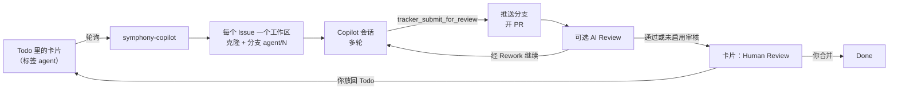

# symphony-copilot

**用 GitHub Copilot 驱动的 [OpenAI Symphony](https://github.com/openai/symphony)。** 把卡片放到 GitHub Project 看板上，拿回 pull request。agent 在你自己的电脑上运行，用的是你已经在付费的 Copilot 套餐。

[English](README.md)

Symphony 的理念是“管理工作，而不是管理 agent”：你写 Issue，调度器把每个 Issue 交给一个 coding agent，在独立的工作区里做，推着它往下走，卡片状态变了就停下。symphony-copilot 按 [Symphony 规范](https://github.com/openai/symphony/blob/main/SPEC.md)实现，换了两样东西：Codex 换成 [GitHub Copilot SDK](https://github.com/github/copilot-sdk)，Linear 换成 GitHub Projects。

## 亮点

- **内核是 Symphony，引擎是 Copilot。** 按规范实现了轮询、每个 Issue 一个工作区、多轮会话、与看板对账、卡死检测、退避重试，以及保存即生效的 `WORKFLOW.md`。
macOS/Linux 上可以选择把 `symphony` 放到 PATH：`ln -s "$PWD/bin/symphony" /usr/local/bin/symphony`。
可选：把 `bin/symphony` 加入 PATH，方便之后运行命令：
```sh
ln -s "$PWD/bin/symphony" /usr/local/bin/symphony   # 可选：把 symphony 命令放到 PATH 上
```
- **本地运行。** agent 就在你电脑上的目录里干活，用你的编译器、SDK、模拟器、数据库和有授权的工具。不用准备容器、虚拟机或 runner。
- **使用现有 Copilot 套餐。** 不要 API key，不要云主机，不耗 Actions 分钟数。会话和 Copilot CLI 一样计量；每张卡片的[运行上限](#运行上限)限制启动会话数，不保证费用或总耗时封顶。[^cost]
- **看板就是界面。** 从 Todo 开始，拿回等待人工审核的 PR，也可先经过独立 AI 审核。需要继续修改时，留言后把等待中的卡片放回 Todo。
- **默认有护栏。** 只能写工作区内的文件；shell 命令要在白名单里；不能联网；令牌不交给 agent；推送只能通过调度器的 `tracker_submit_for_review` 工具。
- **小而易读。** 约 2400 行 TypeScript，不用编译，60 多个单元测试。

[^cost]: 每条提示都计入你的 Copilot 用量额度，和 Copilot CLI 相同（[计费说明](https://docs.github.com/en/copilot/reference/copilot-billing/models-and-pricing)）。超出额度后按 Copilot 正常规则计费。我们端到端测试时，一张小的技术债卡片（改一个测试、跑测试、开 PR）用了 1 次高级请求。

## 工作流程



1. 给 Issue 打上 `agent` 标签，把卡片放进 `tracker.provider.start_state`（比如 Todo），不按活跃列的排列顺序推断入口。
2. symphony-copilot 领取卡片，为它建工作区（示例工作流里，`after_create` hook 会克隆仓库并切到 `agent/<编号>`），然后用 `WORKFLOW.md` 里的提示词启动 Copilot 会话。
3. agent 在同一次会话内调查代码、拟定计划并自我质询，在修改产品代码前把计划写入 Issue，再实现、跑检查、提交并调用 `tracker_submit_for_review`。已有适用计划直接复用，返工时修订重要决策，不等待聊天批准。调度器推送分支，开一个会关闭该 Issue 的 PR，把完整交接记录写进 Issue；启用独立审核时进入 AI Review，否则进入 Human Review。
4. 你来审核。合并 PR 或关闭 Issue 才算完成。需要继续工作时，留言后把等待中的卡片放回 Todo，保留工作区和历史、重新获得会话额度。In Progress、Rework、AI Review 由调度器管理，不要手动移入或移出。

规划不增加 agent 会话或看板列。自动回答不等于人工批准：agent 在授权范围内自主决定，真正缺少关键需求或权限时进入 Blocked。自我质询不能替代独立审核；审核者根据 Issue 检查假设和代码，而不只是核对是否符合计划。运行时自带此流程，无需安装交互式规划 skill。这是提示词层面的工作要求，不是文件写入门禁，也不保证任务一定收敛。详见[自主规划与审核](docs/reference.md#implementation-and-review-method)（英文）。

## 对比

| | OpenAI Symphony | **symphony-copilot** | GitHub Copilot coding agent |
|---|---|---|---|
| coding agent | Codex | GitHub Copilot，套餐里的模型都能用 | GitHub Copilot |
| 任务来源 | Linear | GitHub Projects | 指派给 Copilot 的 Issue |
| 运行位置 | 你的电脑 | 你的电脑 | GitHub Actions |
| 费用 | Codex 用量（ChatGPT 套餐或 OpenAI API） | 你现有的 Copilot 套餐 | Copilot 套餐加 Actions 分钟数 |
| 本机工具、设备和服务 | 能用 | 能用 | 只有 runner 能装上的 |
| 形态 | 规范加 Elixir 参考实现 | 小型 TypeScript 应用 | 托管服务 |

## 快速开始

需要 Node.js 22.18 以上（直接运行 TypeScript）、Git 2.38 以上、[GitHub CLI](https://cli.github.com/) 和一个有 Copilot 套餐的 GitHub 账号。新安装默认使用最新的 Node 24 LTS。CI 会在 macOS 和 Linux 上测试 Node 22.18 与 24；Windows 尚未验证。

**1. 安装并登录。**

```sh
git clone https://github.com/a7744hsc/symphony-copilot.git
cd symphony-copilot
```

在这个仓库里运行首次设置向导：macOS/Linux 用 `./scripts/setup.sh`，Windows PowerShell 用 `powershell -ExecutionPolicy Bypass -File scripts/setup.ps1`。它会检查 Node.js 22.18+、Git 2.38+、npm、GitHub CLI 和 Copilot CLI，列出缺少的工具及安装来源；你确认一次后就自动安装。Node.js 从 nodejs.org 官方归档下载并校验 SHA-256，安装到用户目录；安装官方 npm 包 `@github/copilot` 是为了使用 Copilot CLI，symphony 运行时仍使用 SDK 自带的 runtime。Git 和 GitHub CLI 使用可用的受支持包管理器。若某项无法自动安装，向导会在开始前明确说明。之后会询问是否运行 `npm ci`，然后在同一登录阶段处理 `gh` 和 Copilot CLI：`gh` 用于 GitHub Projects 和 Git 推送，向导仅在当前账号缺少 Projects scope 时请求授权；Copilot CLI 会先检查当前是否已认证，已登录就直接复用，只有未认证时才让你选择浏览器链接或 device code（远程/容器默认推荐 device code）。凭据由相应 CLI 管理；无系统 keychain 的 headless Linux 可能回退到 `~/.copilot/config.json` 明文保存。完整流程见[首次设置](docs/onboarding.md#install-and-sign-in)（英文）。

本机验证使用 GitHub CLI 2.101.0。向导没有设置 `gh` 最低版本，也不会自动升级已安装的版本。

macOS/Linux 上可以选择把 `symphony` 放到 PATH：`ln -s "$PWD/bin/symphony" /usr/local/bin/symphony`。

**2. 配置你的仓库。** agent 要处理的仓库根目录里放一个 `WORKFLOW.md`，它描述所有配置：看板和各列、工作区怎么准备、agent 能运行哪些命令、给 agent 的提示词。先写好它，再按它建看板。完整步骤见 [docs/onboarding.md](docs/onboarding.md)（英文）：

```sh
symphony install-skills   # 只需一次：给 Copilot 装上 symphony-onboard 和 symphony-write-card 两个 skill
# 在你的仓库里用 Copilot（VS Code 或 CLI）运行 /symphony-onboard：它按 examples/ 里的模板
# 写好 WORKFLOW.md、AGENTS.md 和 REVIEW.md，并用 `symphony check` 检查。
symphony setup-board      # 按 WORKFLOW.md 新建看板，并把看板编号写回 WORKFLOW.md
```

把这些文件提交进仓库，提示词就和代码一起做版本管理。看板会有下面这些列，列名在 `WORKFLOW.md` 里自己定：

| 状态 | 含义 |
|---|---|
| Todo | 明确的启动／重新授权入口（`start_state`） |
| In Progress、Rework | 调度器管理的实现和自动返工；In Progress 对应必填 `working_state` |
| AI Review | 调度器管理的独立审核（见[独立审核](#独立审核)） |
| Human Review | 交接：等你处理 |
| Blocked | 必需的等待列（`blocked_state`）：需要人工、启动失败、无进展或会话耗尽，Issue 中保留原因 |
| Done、Canceled | 人工合并／关闭后的终态；按终态清理工作区，AI 批准不是终态 |

状态归属是接入时的工作约定，不是 GitHub 权限锁。人工只从等待列（Human Review／Blocked）移回 Todo 重新授权；其他看板自动化不得替人把已有卡片送回 Todo。

`/symphony-onboard` 会明确请你选择 English（`en`）或简体中文（`zh-CN`），即使采用推荐配置也必须选择，然后写入 `WORKFLOW.md` 顶层的 `language`。卡片、计划、Issue／PR 交接与审核按此配置输出，不按聊天语言推断。两种模式生成的 WORKFLOW 正文和 REVIEW 提示词都保持英文；列名、新增 AGENTS 说明和可选 Issue 表单可以本地化。

本仓库自用的 [WORKFLOW.md](WORKFLOW.md) 已选择 `language: zh-CN`，[任务 Issue 表单](.github/ISSUE_TEMPLATE/agent-task.yml) 也使用中文。WORKFLOW 正文和 REVIEW 提示词仍保持英文，现有看板列名不变。供其他仓库复用的[示例工作流](examples/WORKFLOW.md) 保持 `en`；接入时请选择自己的输出语言。

GitHub Project workflows（项目工作流）独立于 `WORKFLOW.md`，也可能自动改变卡片状态。由于 GitHub 没有公开 API 可供 `setup-board` 配置或启用这些 workflow，上手时不需要修改它们。如果卡片状态意外变化或跳过了 Symphony 阶段，可以到项目网页的 **Workflows** 页面检查已启用的 workflow；它可能是原因之一。

**3. 运行。**

```sh
export SYMPHONY_GITHUB_TOKEN=$(gh auth token)   # 只给调度器用，不会传给 agent

node src/cli.ts ~/code/your-repo/WORKFLOW.md --dry-run --once   # 只读：看看会派发哪些卡片
node src/cli.ts ~/code/your-repo/WORKFLOW.md                    # 常驻运行，Ctrl-C 停止
```

然后用 `/symphony-write-card` 写一张卡片（或者给一个 Issue 打上 `agent` 标签，把卡片拖到 Todo），看日志。

| 参数 | 作用 |
|---|---|
| `--dry-run` | 读取看板，记录本来会派发哪些卡片。不建工作区、不启动 agent、不删除任何东西。 |
| `--once` | 只轮询一次，等派发出去的 agent 结束后退出。 |
| `--log-level` | `debug`、`info`（默认）、`warn` 或 `error`。日志是输出到 stderr 的 `key=value` 行。 |

**也可以用 `bin/symphony`**：它会自动从 `gh` 取令牌，并用稳定的 ID 记住每份工作流：

```sh
symphony start ~/code/your-repo/WORKFLOW.md   # 后台运行；之后直接 `symphony start`
symphony status                               # 有没有在跑、最近一次轮询和最近的事件
symphony logs                                 # 实时看日志
symphony stop                                 # 停止 agent 和调度器，工作区保留
symphony run                                  # 在当前终端前台运行，Ctrl-C 停止
```

日志在 `~/symphony-workspaces/runners/<ID>/orchestrator.log`；设置 `SYMPHONY_STATE_DIR` 可以更换基础目录，`status` 会显示实际路径。在 macOS 上，`start` 还会在调度器运行期间阻止 Mac 自动休眠。

### 一台机器运行多份工作流

每份工作流必须使用**不同的 GitHub Project，以及独立、互不嵌套的 `workspace.root`**。每个进程独立持有配置、提示词、agent、运行账本和日志，不合并配置。

```sh
symphony start ~/code/app/WORKFLOW.md --id app
symphony start ~/code/site/WORKFLOW.md --id site
symphony list                    # 列出稳定 ID、状态和路径
symphony status app              # 只看 app 的状态与近期日志
symphony logs site               # 只跟踪 site 日志；--no-follow 打印后退出
symphony stop app                # site 继续运行
symphony start --id app          # 用记住的路径重启 app
symphony run --id app            # 改为前台运行（先停止后台实例）
```

不指定 `--id` 时，根据规范化后的工作流路径生成 ID，重启不会改变。ID 允许字母、数字、`_` 和 `-`，不区分大小写。只登记一份工作流时，原来的无 ID 命令仍然有效；登记多份后，`status` 列出全部，`start`/`run` 必须给路径或 `--id`，`stop`/`logs` 必须指定 ID，不会擅自选中或停止全部实例。

启动前会拒绝同一看板的第二个运行实例，即使仓库过滤条件或 `SYMPHONY_STATE_DIR` 不同；工作区、账本、日志、配置和提示词路径重叠（包括 `review.prompt_file`、账本保存临时文件、符号链接和硬链接）也会被拒绝。工作流及 reviewer 提示词文件必须放在所有实例的工作区／日志目录之外，每个实例使用独立的输入文件。如果已有 `.symphony-ledger.json.tmp`，启动会被阻止：先停止实例并检查遗留内容，再删除这一确切的临时文件，绝不能删除账本。停止后保留账本、工作区和登记信息。提示词**内容**及普通配置仍可热加载；输入路径（包括 `review.prompt_file` 或启用／禁用 review）、工作区或 tracker 身份变更必须停止后重启。直接执行 `node src/cli.ts` 也参与同一套隔离检查；只读 `--dry-run` 不占用资源。

工作区所有权覆盖配置中的根目录链接入口及中间符号链接路径，不只覆盖最终解析目标：放在另一实例工作区下的链接可能被终态清理删除，因此不安全。即使新路径指向同一目标，更换根目录别名也必须重启。互不嵌套的兄弟根目录可以共用一个符号链接父目录。

**升级：**先停止旧版本启动的实例，再运行新版本。首次使用仍会读取旧的 `.last-workflow`，但日志改为按 ID 存放，不会迁移旧日志。协调范围是同一台机器上的一个可信操作系统用户，不跨用户或跨机器；不支持多个实例共享一个看板。恢复方式见[参考文档](docs/reference.md#runner-management-and-recovery)。

## 配置

`WORKFLOW.md` 由 YAML front matter 和一个 [Liquid](https://liquidjs.com/) 提示词模板组成；未知的变量和过滤器都会报错。保存了无效的文件时，调度器记录错误，继续用上一份有效配置。所有键的说明在 [schema/workflow.schema.json](schema/workflow.schema.json)；`symphony check` 按它和 [docs/reference.md](docs/reference.md#checking-a-workflow) 里的规则检查文件。

规范里的键（`tracker`、`polling`、`workspace`、`hooks`、`agent`）含义和默认值都不变，扩展项包括：

- `language`：`en`（英文）或 `zh-CN`（简体中文）。旧工作流省略时默认为 `en`，其他值（包括 `null`）均报错。它决定新增的面向用户输出，不翻译已有内容。运行中的会话保持原语言；有效修改用于后续会话，已接受的交接在发布重试／重启后仍保留原语言。覆盖范围与限制见[输出语言](docs/reference.md#output-language)（英文）。
- `agent.continuation_prompt`：之后每一轮开头发送的消息，可用变量 `issue`、`turn`、`max_turns`。
- `agent.max_sessions`：见[运行上限](#运行上限)。
- `agent.usage_comments`（默认 `true`）：尽力按本会话选定的语言在 Issue 结果消息末尾补一行，不另发纯用量评论。`zh-CN` 示例：`用量（本轮）：12.34 · 轮次 6/20 · 模型：xxxx`。显示本会话 AI credits、已启动会话序号／上限和实际模型（可多个），不是配置中的 `auto` 或累计费用。指标缺失、更新失败时可以没有尾行，不做持久化补写队列。详细指标仍记入 `session summary` 日志；关闭尾行不影响必要的失败说明。

`copilot` 块是本实现特有的：

| 键 | 默认 | 含义 |
|---|---|---|
| `model`、`reasoning_effort` | 运行时默认 | 传给 Copilot 会话 |
| `shell_allow` | 内置列表 | 在内置的 git 和文件工具**之外**额外允许的命令 |
| `shell_deny` | 内置列表 | 在内置列表之外额外禁止的命令；禁止优先 |
| `read_allow` | 无 | 工作区之外允许 agent 读取的目录 |
| `url_allow` | 无 | 允许 agent 访问的 URL 前缀 |
| `user_input_reply` | 英文指令 | agent 提问时的自动回答；运行时同时追加选定输出语言的指令 |
| `cli_path` | SDK 自带的运行时 | 指定 Copilot CLI 可执行文件 |
| `startup_timeout_ms` | 60000 | 启动运行时、创建会话的超时 |
| `turn_timeout_ms` | 3600000 | 一轮内两次会话事件之间的最长静默 |
| `stall_timeout_ms` | 300000 | agent 静默超过这个时长，调度器就重启它；`<= 0` 关闭 |

hook 用 `bash -lc` 在工作区里执行，环境变量里去掉了 tracker 令牌，并加上 `SYMPHONY_ISSUE_ID`、`SYMPHONY_ISSUE_IDENTIFIER`、`SYMPHONY_ISSUE_BRANCH`、`SYMPHONY_WORKSPACE`、`SYMPHONY_WORKSPACE_KEY`、`SYMPHONY_ROLE`（`implement` 或 `review`），审核者还有 `SYMPHONY_IMPLEMENTER_WORKSPACE`。

技术日志、CLI 诊断和接入仓库前的安装向导仍使用英文。agent 通过运行时指令按所选语言写作，不使用机器翻译；标识符、工具／YAML 协议、原始诊断和 GitHub 的 `Closes` 关键字保持不变。

GitHub Project 适配器的设置、agent 工具、错误分类，以及规范如何对应到 Copilot SDK，见 [docs/reference.md](docs/reference.md)（英文）。

## 运行上限

一次授权覆盖同一 Issue 的实现、审核和自动返工，也包括进入人工审核后的自动冲突退回。只有一个共享会话上限：

| 键 | 默认 | 含义 |
|---|---|---|
| `agent.max_sessions` | 20 | 每次 Issue 授权内成功创建的 SDK 会话总数，实现者与审核者合计；不是 20 对实现／审核，也不是模型请求数或会话内 turn 数 |

每次 `createSession` 成功扣一次，即使首条提示随后失败也计数。创建会话前的工作区准备、hook 或启动失败，会记录阶段和错误并暂停到必填的 `tracker.provider.blocked_state`，不扣次数、不无限重试；启动结果不确定则暂停核对，不猜作免费。最后一次已启动会话可以完成，但不会超额再启动；实现提交后若没有审核额度，会明确标为未审核并进入 Blocked，不冒充通过。

人工把等待中的卡片（Blocked／Human Review）移回 `start_state`（Todo）才重新授权：重置会话额度和无进展计数，不丢弃分支、工作区、Issue 历史或累计用量。自动 Rework／冲突退回、暂停和重启都不重置。控制状态保存在 `workspace.root` 下的 `.symphony-ledger.json`。

启动结果不确定是普通看板恢复的例外：移回 Todo 或重启宿主不能证明旧 runtime 已停止。只有原运行器确认启动请求已结束、清理成功后才解除持久化保护。若宿主在此前崩溃，任务保持暂停，需要核实残留 runtime 和账本后人工恢复；不要删除账本来绕过保护。

费用只记录给人看，不作为停止阈值。没有绝对总耗时上限；启动和静默超时仍用于运行保护。接入默认显式设并发为 1、模型为 `auto`；提高并发可能增加用量。

**旧工作流迁移：** 补齐 `tracker.provider.start_state`、`working_state`、`blocked_state`；删除 `copilot.max_ai_credits`、`copilot.max_ai_credits_per_issue`、`review.max_rounds`（现在会报配置错误），从审核模板删除 `max_review_rounds`。详见[参考文档](docs/reference.md#prompt-templates)。

## 独立审核

可以让每次提交先经过第二个 agent 审核，再交给人。在看板上加一列（比如“AI 审查”），写进 `tracker.active_states`，设为 `handoff_state`，再加：

```yaml
review:
  states: [AI 审查]
  prompt_file: REVIEW.md      # Liquid 模板；变量 issue、attempt、review_round、implementer_workspace
  model: auto                # 固定 ID 仅用用户提供或已验证账号可用的值
  pass_state: 待验证
  fail_state: 返工
```

审核者：

- 每次都是新会话，看不到实现者的思考过程；
- 在自己的工作区（`<issue>-review`）里工作。`SYMPHONY_ROLE` 为 `review` 时，由你的 `before_run` hook 把它重置到已推送的分支；可以读实现者的工作区，但不能改；
- 不能 commit、推送或开 PR，只能用 `tracker_submit_review` 结束：先保存完整 Issue 记录，再镜像到 PR 并交接。

审核者提供被检查的 SHA、有证据的进展判断和具体下一步。批准进入 Human Review；首次发现可修问题或返工有进展可以继续，首次经审核的无进展返工要换方法，连续两次则暂停到 Blocked。只有正式提交且实际审核过的返工才计数，初审问题和基础设施失败不算停滞。缺少验证条件时用 `unable_to_verify` 明确交给人工并进入 Blocked，不当作批准或无进展。调度器执行这些规则及剩余会话额度，不设独立审核轮数上限。

换角色会启动新会话，消耗一个共享名额。`review_round` 只是审核序号，与 SDK turn 和会话总次数分开。GitHub 不允许 PR 作者批准或要求修改自己的 PR，所以结论体现在卡片状态和评论式审核里。两个角色都要把处理过的人工 PR 意见及关键约束写进 Issue 交接；这不代表系统自动同步每条人工评论。

## 合并冲突

等你审核的 PR，可能因为别的 PR 先合并而合不进去了。加上：

```yaml
merge_conflicts:
  states: [待验证]            # 等人处理的列（不是活跃列）；每次轮询都检查它们的 PR
  return_state: 返工          # 由实现者处理的活跃列
```

GitHub 报告 `states` 中某张可派发卡片的 PR 有冲突时，调度器把卡片移到 `return_state`，留言说明原因，并排在所有卡片之前派发（不打断正在跑的 agent）。agent 合并基准分支、解决冲突、重跑检查后再次提交，结果和其他改动一样要经过审核。`tracker_submit_for_review` 会拒绝与基准分支冲突的 HEAD，所以卡片不会在列之间原地来回。想自己解决冲突，就在卡片等你的时候去掉 `agent` 标签。

自动冲突退回沿用原额度，不能重启已暂停或耗尽次数的工作。`return_state` 不得是 Todo，冲突监测列也不得包含 Blocked。

移除必需的派发标签，也会暂停已经接受但尚未完成的交接发布，包括重启后的恢复；结果已接受不代表仍可推送或移动卡片。恢复派发资格且卡片仍在适用的源／目标状态时，可继续同一交接，不新增 agent 会话或重置额度。已经完成的外部操作不会撤销；详见[发布恢复](docs/reference.md#agent-tools)。

## 安全模型

symphony-copilot 面向**在自己电脑上运行的单个可信用户**，它不是沙箱。

- 每个 agent 以自己的工作区为工作目录，所有工作区都必须在 `workspace.root` 之下。
- tracker 令牌只留在调度器进程里。agent 和 hook 的环境变量里会去掉 `SYMPHONY_GITHUB_TOKEN`、`GH_TOKEN`、`GITHUB_TOKEN` 等。
- agent 的每个权限请求都经过 [src/policy.ts](src/policy.ts)：
  - 写文件必须在工作区内，解析符号链接后也一样。
  - 读文件限于工作区和 `read_allow`。
  - shell 命令的每一段都要命中白名单、不命中黑名单。内置黑名单包括 `git push`、`git remote`、`git config`、`git -c`、`git -C`、`gh`、`curl`、`wget`、`ssh`、`sudo`、`open`。
  - 会写入的 shell 命令只能碰工作区内的路径；带 URL 的命令、要求绕过沙箱的请求都会被拒绝。
  - URL 访问、MCP 工具、memory 一律拒绝，只放行调度器自己的 `tracker_*` 工具。
- agent 提问时会收到 `user_input_reply`，不会一直干等。

已知缺口：本机 `gh` 的登录保存在系统钥匙串里，只靠黑名单拦住 agent 使用它。能再启动其他程序的已允许命令（比如 `find -exec`，或 agent 能改的构建脚本）仍然可以做你的用户能做的任何事。要更强的隔离，请用单独的系统用户运行调度器。

## 现状

早期版本（v0.1）。已在一个真实项目上端到端跑通（Swift，含 Xcode 构建和模拟器测试），一次一个 agent。会有粗糙之处，也可能有不兼容的改动。

接下来计划：

- 发布 npm 包，可以用 `npx` 运行
- 终端里的实时状态，以及规范里可选的 HTTP 状态接口
- 工作区删除后保留运行证据（日志、截图）
- 支持更多 tracker

欢迎提 Issue 和 PR。

## 致谢

调度设计来自 [OpenAI Symphony](https://github.com/openai/symphony)（Apache-2.0）。symphony-copilot 是其规范的独立实现，基于 [GitHub Copilot SDK](https://github.com/github/copilot-sdk)，与 OpenAI、GitHub 均无隶属或背书关系。

## 许可证

[MIT](LICENSE)
