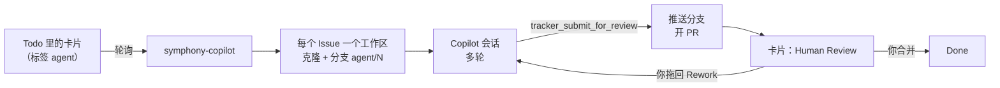

# symphony-copilot

**用 GitHub Copilot 驱动的 [OpenAI Symphony](https://github.com/openai/symphony)。** 把卡片放到 GitHub Project 看板上，拿回 pull request。agent 在你自己的电脑上运行，用的是你已经在付费的 Copilot 套餐。

[English](README.md)

Symphony 的理念是“管理工作，而不是管理 agent”：你写 Issue，调度器把每个 Issue 交给一个 coding agent，在独立的工作区里做，推着它往下走，卡片状态变了就停下。symphony-copilot 按 [Symphony 规范](https://github.com/openai/symphony/blob/main/SPEC.md)实现，换了两样东西：Codex 换成 [GitHub Copilot SDK](https://github.com/github/copilot-sdk)，Linear 换成 GitHub Projects。

## 亮点

- **内核是 Symphony，引擎是 Copilot。** 按规范实现了轮询、每个 Issue 一个工作区、多轮会话、与看板对账、卡死检测、退避重试，以及保存即生效的 `WORKFLOW.md`。
macOS/Linux 上可以选择把 `symphony` 放到 PATH：`ln -s "$PWD/bin/symphony" /usr/local/bin/symphony`。
可选：把 `bin/symphony` 加入 PATH，方便之后运行命令：
```sh
ln -s "$PWD/bin/symphony" /usr/local/bin/symphony   # 可选：把 symphony 命令放到 PATH 上
```
- **本地运行。** agent 就在你电脑上的目录里干活，用你的编译器、SDK、模拟器、数据库和有授权的工具。不用准备容器、虚拟机或 runner。
- **零额外成本。** 不要 API key，不要云主机，不耗 Actions 分钟数。会话走你现有的 Copilot 套餐，和 Copilot CLI 一样计量；每张卡片有[运行上限](#运行上限)，花费有封顶。[^cost]
- **看板就是界面。** 把卡片拖到 Todo，PR 就会出现，卡片同时移到 Human Review。拖到 Rework，agent 会读审核意见接着改。
- **默认有护栏。** 只能写工作区内的文件；shell 命令要在白名单里；不能联网；令牌不交给 agent；推送只能通过调度器的 `tracker_submit_for_review` 工具。
- **小而易读。** 约 2400 行 TypeScript，不用编译，60 多个单元测试。

[^cost]: 每条提示都计入你的 Copilot 用量额度，和 Copilot CLI 相同（[计费说明](https://docs.github.com/en/copilot/reference/copilot-billing/models-and-pricing)）。超出额度后按 Copilot 正常规则计费。我们端到端测试时，一张小的技术债卡片（改一个测试、跑测试、开 PR）用了 1 次高级请求。

## 工作流程



1. 给 Issue 打上 `agent` 标签，把卡片放进活跃列（比如 Todo）。
2. symphony-copilot 领取卡片，为它建工作区（示例工作流里，`after_create` hook 会克隆仓库并切到 `agent/<编号>`），然后用 `WORKFLOW.md` 里的提示词启动 Copilot 会话。
3. agent 干活、跑检查、提交，然后调用 `tracker_submit_for_review`。调度器推送分支，开一个会关闭该 Issue 的 PR，把卡片移到 Human Review。
4. 你来审核。合并后卡片进入 Done；或者拖回 Rework，agent 会在同一个工作区里带着你的审核意见继续。

## 对比

| | OpenAI Symphony | **symphony-copilot** | GitHub Copilot coding agent |
|---|---|---|---|
| coding agent | Codex | GitHub Copilot，套餐里的模型都能用 | GitHub Copilot |
| 任务来源 | Linear | GitHub Projects | 指派给 Copilot 的 Issue |
| 运行位置 | 你的电脑 | 你的电脑 | GitHub Actions |
| 费用 | Codex 用量（ChatGPT 套餐或 OpenAI API） | 你现有的 Copilot 套餐 | Copilot 套餐加 Actions 分钟数 |
| 本机工具、设备和服务 | 能用 | 能用 | 只有 runner 能装上的 |
| 形态 | 规范加 Elixir 参考实现 | 小型 TypeScript 应用 | 托管服务 |

## 快速开始

需要 Node.js 22.18 以上（直接运行 TypeScript）、Git 2.38 以上、[GitHub CLI](https://cli.github.com/) 和一个有 Copilot 套餐的 GitHub 账号。新安装默认使用最新的 Node 24 LTS。CI 会在 macOS 和 Linux 上测试 Node 22.18 与 24；Windows 尚未验证。

**1. 安装并登录。**

```sh
git clone https://github.com/a7744hsc/symphony-copilot.git
cd symphony-copilot
```

在这个仓库里运行首次设置向导：macOS/Linux 用 `./scripts/setup.sh`，Windows PowerShell 用 `powershell -ExecutionPolicy Bypass -File scripts/setup.ps1`。它会检查 Node.js 22.18+、Git 2.38+、npm、GitHub CLI 和 Copilot CLI，列出缺少的工具及安装来源；你确认一次后就自动安装。Node.js 从 nodejs.org 官方归档下载并校验 SHA-256，安装到用户目录；安装官方 npm 包 `@github/copilot` 是为了使用 Copilot CLI，symphony 运行时仍使用 SDK 自带的 runtime。Git 和 GitHub CLI 使用可用的受支持包管理器。若某项无法自动安装，向导会在开始前明确说明。之后会询问是否运行 `npm ci`，然后在同一登录阶段处理 `gh` 和 Copilot CLI：`gh` 用于 GitHub Projects 和 Git 推送，向导仅在当前账号缺少 Projects scope 时请求授权；Copilot CLI 会先检查当前是否已认证，已登录就直接复用，只有未认证时才让你选择浏览器链接或 device code（远程/容器默认推荐 device code）。凭据由相应 CLI 管理；无系统 keychain 的 headless Linux 可能回退到 `~/.copilot/config.json` 明文保存。完整流程见[首次设置](docs/onboarding.md#install-and-sign-in)（英文）。

本机验证使用 GitHub CLI 2.101.0。向导没有设置 `gh` 最低版本，也不会自动升级已安装的版本。

macOS/Linux 上可以选择把 `symphony` 放到 PATH：`ln -s "$PWD/bin/symphony" /usr/local/bin/symphony`。

**2. 配置你的仓库。** agent 要处理的仓库根目录里放一个 `WORKFLOW.md`，它描述所有配置：看板和各列、工作区怎么准备、agent 能运行哪些命令、给 agent 的提示词。先写好它，再按它建看板。完整步骤见 [docs/onboarding.md](docs/onboarding.md)（英文）：

```sh
symphony install-skills   # 只需一次：给 Copilot 装上 symphony-onboard 和 symphony-write-card 两个 skill
# 在你的仓库里用 Copilot（VS Code 或 CLI）运行 /symphony-onboard：它按 examples/ 里的模板
# 写好 WORKFLOW.md、AGENTS.md 和 REVIEW.md，并用 `symphony check` 检查。
symphony setup-board      # 按 WORKFLOW.md 新建看板，并把看板编号写回 WORKFLOW.md
```

把这些文件提交进仓库，提示词就和代码一起做版本管理。看板会有下面这些列，列名在 `WORKFLOW.md` 里自己定：

| 状态 | 含义 |
|---|---|
| Todo、In Progress、Rework | 活跃：调度器会在这些卡片上运行 agent |
| AI Review | 活跃：另一个 agent 审核 PR（见[独立审核](#独立审核)） |
| Human Review | 交接：等你处理 |
| Blocked | agent 需要帮助，会先在 Issue 下留言 |
| Done、Canceled | 终止：删除工作区；如果 agent 还在运行就立即删，否则在调度器下次启动时删 |

GitHub Project workflows（项目工作流）独立于 `WORKFLOW.md`，也可能自动改变卡片状态。由于 GitHub 没有公开 API 可供 `setup-board` 配置或启用这些 workflow，上手时不需要修改它们。如果卡片状态意外变化或跳过了 Symphony 阶段，可以到项目网页的 **Workflows** 页面检查已启用的 workflow；它可能是原因之一。

**3. 运行。**

```sh
export SYMPHONY_GITHUB_TOKEN=$(gh auth token)   # 只给调度器用，不会传给 agent

node src/cli.ts ~/code/your-repo/WORKFLOW.md --dry-run --once   # 只读：看看会派发哪些卡片
node src/cli.ts ~/code/your-repo/WORKFLOW.md                    # 常驻运行，Ctrl-C 停止
```

然后用 `/symphony-write-card` 写一张卡片（或者给一个 Issue 打上 `agent` 标签，把卡片拖到 Todo），看日志。

| 参数 | 作用 |
|---|---|
| `--dry-run` | 读取看板，记录本来会派发哪些卡片。不建工作区、不启动 agent、不删除任何东西。 |
| `--once` | 只轮询一次，等派发出去的 agent 结束后退出。 |
| `--log-level` | `debug`、`info`（默认）、`warn` 或 `error`。日志是输出到 stderr 的 `key=value` 行。 |

**也可以用 `bin/symphony`**：它会自动从 `gh` 取令牌，并管理多个相互隔离的 runner。每个工作流默认使用由规范路径生成的稳定 ID；也可以用 `--id` 指定易记的名字：

```sh
symphony start --id api ~/code/api/WORKFLOW.md
symphony start --id web ~/code/web/WORKFLOW.md
symphony status                 # 列出所有已注册的 runner
symphony status api             # 只看 api 的进程、最近轮询和事件
symphony logs api               # 只实时看 api 的日志
symphony stop api               # 只停止 api，保留它的工作区
symphony run --id jobs ~/code/jobs/WORKFLOW.md  # 前台运行，Ctrl-C 停止
```

省略工作流路径时会复用最近启动的工作流。`status` 不带 ID 时会列出所有 runner。只有一个 runner 正在运行，或没有 runner 运行且只有一个已注册 runner 时，`logs` 和 `stop` 可以省略 ID，以兼容原来的单工作流用法；否则必须指定 ID。在 macOS 上，`start` 还会在对应 runner 运行期间阻止 Mac 自动休眠。

每个 runner 都有独立的配置进程、位于 `workspace.root` 的运行账本、`~/symphony-workspaces/logs/<id>.log` 日志和工作区。设置 `SYMPHONY_STATE_DIR` 可以移动日志和最近工作流记录；主机级所有权注册表仍保存在操作系统用户的主目录下，因此更改状态目录无法绕过冲突检查。ID 不区分大小写。正在运行的 runner 必须使用文件系统层面不同且互不重叠的工作流路径和工作区根目录、不同的实际日志文件，并且配置输入（`WORKFLOW.md` 和 `review.prompt_file`）及托管状态不能位于其他 runner 的工作区内；互不相关的 runner 仍可共享常规状态/日志目录。两个 runner 不能管理同一个 GitHub Project：在没有安全的共享卡片认领机制时，它们可能重复派发同一张卡片，所以第二个 runner 会在启动时被拒绝，并说明冲突 runner 的 ID。请先停止第一个 runner，或让第二个工作流使用其他 Project。

## 配置

`WORKFLOW.md` 由 YAML front matter 和一个 [Liquid](https://liquidjs.com/) 提示词模板组成；未知的变量和过滤器都会报错。保存了无效的文件时，调度器记录错误，继续用上一份有效配置。所有键的说明在 [schema/workflow.schema.json](schema/workflow.schema.json)；`symphony check` 按它和 [docs/reference.md](docs/reference.md#checking-a-workflow) 里的规则检查文件。

规范里的键（`tracker`、`polling`、`workspace`、`hooks`、`agent`）含义和默认值都不变，另外多了三个：

- `agent.continuation_prompt`：之后每一轮开头发送的消息，可用变量 `issue`、`turn`、`max_turns`。
- `agent.max_sessions`：见[运行上限](#运行上限)。
- `agent.usage_comments`（默认 `true`）：每个会话结束后，调度器在 Issue 下留言，写明结果、模型和调用次数、轮次、耗时、改动行数、AI credits（本会话和本次运行）以及 token。同样的摘要总会以 `session summary` 写进日志。

`copilot` 块是本实现特有的：

| 键 | 默认 | 含义 |
|---|---|---|
| `model`、`reasoning_effort` | 运行时默认 | 传给 Copilot 会话 |
| `max_ai_credits_per_issue` | 无上限 | 每张卡片每次运行的 AI credits 预算，由调度器执行，见[运行上限](#运行上限) |
| `max_ai_credits` | 无上限 | 由 Copilot 运行时执行的单个会话上限。运行时会把用量告诉模型，测试中模型因此偷工；建议改用 `max_ai_credits_per_issue`。 |
| `shell_allow` | 内置列表 | 在内置的 git 和文件工具**之外**额外允许的命令 |
| `shell_deny` | 内置列表 | 在内置列表之外额外禁止的命令；禁止优先 |
| `read_allow` | 无 | 工作区之外允许 agent 读取的目录 |
| `url_allow` | 无 | 允许 agent 访问的 URL 前缀 |
| `user_input_reply` | 英文 | agent 提问时的自动回答 |
| `cli_path` | SDK 自带的运行时 | 指定 Copilot CLI 可执行文件 |
| `startup_timeout_ms` | 60000 | 启动运行时、创建会话的超时 |
| `turn_timeout_ms` | 3600000 | 一轮内两次会话事件之间的最长静默 |
| `stall_timeout_ms` | 300000 | agent 静默超过这个时长，调度器就重启它；`<= 0` 关闭 |

hook 用 `bash -lc` 在工作区里执行，环境变量里去掉了 tracker 令牌，并加上 `SYMPHONY_ISSUE_ID`、`SYMPHONY_ISSUE_IDENTIFIER`、`SYMPHONY_ISSUE_BRANCH`、`SYMPHONY_WORKSPACE`、`SYMPHONY_WORKSPACE_KEY`、`SYMPHONY_ROLE`（`implement` 或 `review`），审核者还有 `SYMPHONY_IMPLEMENTER_WORKSPACE`。

GitHub Project 适配器的设置、agent 工具、错误分类，以及规范如何对应到 Copilot SDK，见 [docs/reference.md](docs/reference.md)（英文）。

## 运行上限

“一次运行”指一张卡片的一段连续工作：从卡片被派发开始，到调度器看到卡片离开活跃列为止（交接审核、受阻、完成，或被你移走）。按规范，只要卡片还在活跃列就会不断开新会话，一张始终不交接的卡片可能无限花钱。所以调度器对每次运行设两个上限：

| 键 | 默认 | 含义 |
|---|---|---|
| `agent.max_sessions` | 5 | 每次运行最多几个 Copilot 会话。一个会话在跑满 `max_turns` 轮或 agent 停下时结束。 |
| `copilot.max_ai_credits_per_issue` | 无上限 | 每次运行的 AI credits，按每次模型调用实时累计，一到预算就停下会话。 |

碰到上限时，调度器停下 agent，在 Issue 下留言说明这次运行用了多少，如果设了 `tracker.provider.blocked_state` 就把卡片移过去。工作区保留。把卡片拖回活跃列就开始新的一次运行，上限重新计算；交接后返工也一样。

模型永远看不到这两个上限。用量保存在 `workspace.root` 下的 `.symphony-ledger.json`，重启调度器不会清零。无人值守运行时，请两个上限和 `blocked_state` 都设上。

## 独立审核

可以让每次提交先经过第二个 agent 审核，再交给人。在看板上加一列（比如“AI 审查”），写进 `tracker.active_states`，设为 `handoff_state`，再加：

```yaml
review:
  states: [AI 审查]
  prompt_file: REVIEW.md      # Liquid 模板；变量 issue、attempt、review_round、max_review_rounds、implementer_workspace
  model: gpt-6-sol            # 最好和实现者不是同一家模型
  pass_state: 待验证
  fail_state: 返工
  max_rounds: 3               # 最后一轮仍不通过，卡片进 pass_state，由人决定
```

审核者：

- 每次都是新会话，看不到实现者的思考过程；
- 在自己的工作区（`<issue>-review`）里工作。`SYMPHONY_ROLE` 为 `review` 时，由你的 `before_run` hook 把它重置到已推送的分支；可以读实现者的工作区，但不能改；
- 不能推送、不能开 PR，只能用 `tracker_submit_review` 结束：在 PR 和 Issue 上发出结论，并移动卡片。

卡片在实现和审核之间切换时，正在跑的会话会结束，另一个角色在新会话里开始。整个“实现—审核”来回算一次运行，[运行上限](#运行上限)同样管得住。GitHub 不允许 PR 的作者批准或要求修改自己的 PR，所以结论体现在卡片状态和评论式审核里。

## 合并冲突

等你审核的 PR，可能因为别的 PR 先合并而合不进去了。加上：

```yaml
merge_conflicts:
  states: [待验证]            # 等人处理的列（不是活跃列）；每次轮询都检查它们的 PR
  return_state: 返工          # 由实现者处理的活跃列
```

GitHub 报告 `states` 中某张可派发卡片的 PR 有冲突时，调度器把卡片移到 `return_state`，留言说明原因，并排在所有卡片之前派发（不打断正在跑的 agent）。agent 合并基准分支、解决冲突、重跑检查后再次提交，结果和其他改动一样要经过审核。`tracker_submit_for_review` 会拒绝与基准分支冲突的 HEAD，所以卡片不会在列之间原地来回。想自己解决冲突，就在卡片等你的时候去掉 `agent` 标签。

## 安全模型

symphony-copilot 面向**在自己电脑上运行的单个可信用户**，它不是沙箱。

- 每个 agent 以自己的工作区为工作目录，所有工作区都必须在 `workspace.root` 之下。
- tracker 令牌只留在调度器进程里。agent 和 hook 的环境变量里会去掉 `SYMPHONY_GITHUB_TOKEN`、`GH_TOKEN`、`GITHUB_TOKEN` 等。
- agent 的每个权限请求都经过 [src/policy.ts](src/policy.ts)：
  - 写文件必须在工作区内，解析符号链接后也一样。
  - 读文件限于工作区和 `read_allow`。
  - shell 命令的每一段都要命中白名单、不命中黑名单。内置黑名单包括 `git push`、`git remote`、`git config`、`git -c`、`git -C`、`gh`、`curl`、`wget`、`ssh`、`sudo`、`open`。
  - 会写入的 shell 命令只能碰工作区内的路径；带 URL 的命令、要求绕过沙箱的请求都会被拒绝。
  - URL 访问、MCP 工具、memory 一律拒绝，只放行调度器自己的 `tracker_*` 工具。
- agent 提问时会收到 `user_input_reply`，不会一直干等。

已知缺口：本机 `gh` 的登录保存在系统钥匙串里，只靠黑名单拦住 agent 使用它。能再启动其他程序的已允许命令（比如 `find -exec`，或 agent 能改的构建脚本）仍然可以做你的用户能做的任何事。要更强的隔离，请用单独的系统用户运行调度器。

## 现状

早期版本（v0.1）。已在一个真实项目上端到端跑通（Swift，含 Xcode 构建和模拟器测试），一次一个 agent。会有粗糙之处，也可能有不兼容的改动。

接下来计划：

- 发布 npm 包，可以用 `npx` 运行
- 终端里的实时状态，以及规范里可选的 HTTP 状态接口
- 工作区删除后保留运行证据（日志、截图）
- 支持更多 tracker

欢迎提 Issue 和 PR。

## 致谢

调度设计来自 [OpenAI Symphony](https://github.com/openai/symphony)（Apache-2.0）。symphony-copilot 是其规范的独立实现，基于 [GitHub Copilot SDK](https://github.com/github/copilot-sdk)，与 OpenAI、GitHub 均无隶属或背书关系。

## 许可证

[MIT](LICENSE)
